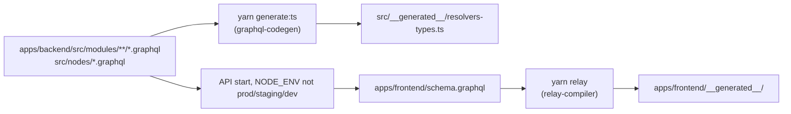

---
paths:
  - "apps/backend/**/*.graphql"
  - "apps/backend/**/*.resolver.ts"
  - "apps/frontend/**/*.graphql.ts"
  - "apps/frontend/graphql/**"
  - "apps/frontend/schema.graphql"
---

# GraphQL Instructions

The schema is authored in the backend and flows to the frontend. Understanding this direction is the single most
important thing about the codebase: **the frontend never edits the schema**.

## Rules

- Author types, queries and mutations in the module's `.graphql` file, next to its resolver and service.
- After a backend schema change, run `yarn workspace @xtm-hub/backend generate:ts` so
  `src/__generated__/resolvers-types.ts` matches.
- `apps/frontend/schema.graphql` is **generated**. It is refreshed when the API starts outside
  production/staging/development. Do not hand-edit it.
- After the schema moves, run `yarn workspace @xtm-hub/frontend relay`. Skipping this is the most common source of
  bogus frontend type errors.
- Resolvers are merged in `apps/backend/src/server/graphql-schema.ts`. A new module's resolver has to be registered
  there or its fields silently do not exist.
- Adding, renaming, or reshaping an operation? Update the matching `.bru` request under `bruno/` too — see
  [`backend.md`](backend.md#api-collection-bruno).

## Authorization

Access control belongs on the schema through the `@auth` directive, implemented by the transformer in
`apps/backend/src/security/directive-graphql/`. Prefer declaring it on the field over hand-rolling checks inside a
resolver.

## Relay conventions (existing pages only)

- The schema is Relay-compatible: it exposes the `Node` interface (`apps/backend/src/nodes/`) and
  Connection/PageInfo types (`apps/backend/src/modules/common/`).
- Paginated fields must return a Connection, and the backend side should use `paginate()` from the Knex layer.
- Frontend operations live in `*.graphql.ts` files using the `graphql` tagged template; artifacts land in
  `apps/frontend/__generated__/` (aliased as `@generated/*`).

## `@tanstack/react-query` conventions (new frontend work)

- Frontend operations live in `apps/frontend/graphql/<domain>/<name>.query.graphql` (or `.mutation.graphql`).
- `yarn workspace @xtm-hub/frontend codegen` (`graphql-codegen`, `typescript-react-query` plugin) refreshes
  `apps/frontend/graphql/generated.ts` (aliased `@graphql/*`), which exports a typed `use<Name>Query` /
  `use<Name>Mutation` hook plus its query key per operation.
- Call the hook with `portalGraphqlClient` from `apps/frontend/src/lib/graphql-client.ts` (a `graphql-request`
  client) as the first argument; manage cache invalidation with `@tanstack/react-query`'s `useQueryClient()`.

## Subscriptions

Delivered over GraphQL SSE (`graphql-sse`) on `/graphql-sse`, backed by the PubSub in `apps/backend/src/pub.ts`. The
Next.js `proxy.ts` (the Next.js 16 convention file, renamed from `middleware.ts`) proxies that path to the API.
