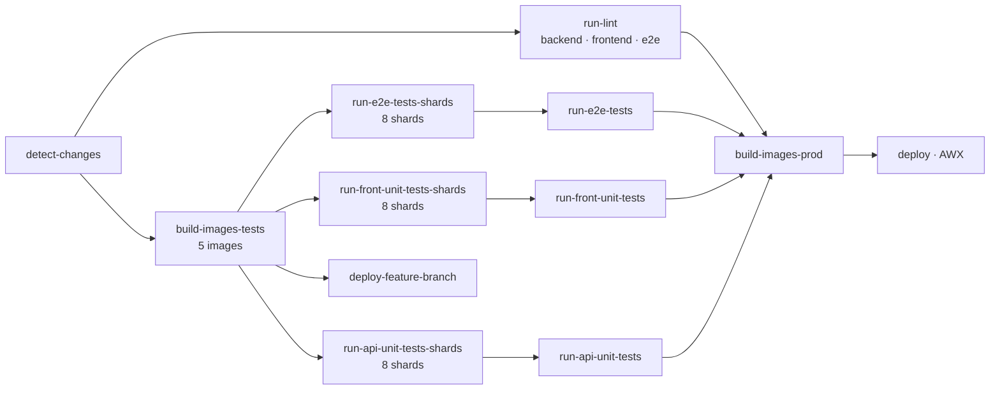

# CI, Docker & Deployment Instructions

## Main pipeline

`.github/workflows/dockerbuild-ci.yml` runs on `workflow_dispatch`, `merge_group`, pushes to `main` and `v*` tags
(filtered to `apps/**`, the workflow file, `package.json`, `yarn.lock`), and pull requests targeting `main` or
`issue/*`.



- **detect-changes** gates the pipeline on a `code` path filter.
- **run-lint** is a matrix over `apps/backend`, `apps/frontend`, `apps/e2e`.
- **build-images-tests** builds `portal-front`, `portal-api`, `portal-e2e-tests`, `portal-front-test`,
  `portal-api-test` in parallel.
- The three test suites each fan out over **8 shards**; the unsharded `run-*-tests` jobs are `always()` aggregators
  that collect the shard results, and they are what `build-images-prod` actually depends on. Unit test jobs are
  skipped on tag builds.
- **deploy-feature-branch** publishes an ephemeral preview at `https://dev-pr-{number}.hub.staging.filigran.io`.
- **build-images-prod** and **deploy** only run outside pull requests.

If you add a test file, it lands in a shard automatically — do not hardcode shard counts in scripts.

Before the Docker builds, migrations and seeds are copied into the e2e workspace:

```bash
cp -r ./apps/backend/src/migrations ./apps/e2e/migrations
cp -r ./apps/backend/tests/seeds ./apps/e2e/seeds
```

## Feature environments (opt-out)

`deploy-feature-branch` runs for every pull request unless the `skip-feature-env` label is present.

| Label | Feature env deployed? | "Ready for merging" auto-set? |
| --- | --- | --- |
| *(none)* | Yes — default | No; requires manual testing first |
| `skip-feature-env` | No | Yes, once checks and approval pass |

Removing `skip-feature-env` from an open pull request triggers a redeploy through
`.github/workflows/pr-issue-automation.yml`.

## Node and Yarn in CI

- Always resolve Node from `.nvmrc` (`actions/setup-node` with `node-version-file: .nvmrc`) in any job that checks
  out the repository. `test-feature-branch.yml` hardcodes the version because it has no checkout step — if you add
  one, switch it to `node-version-file` at the same time.
- Always `corepack enable` and let Yarn resolve from the `packageManager` field in the root `package.json`. Do not
  pass an explicit version to `corepack prepare`; a pinned version silently diverges from `packageManager`.
- **Do not set `cache: yarn` on `actions/setup-node`.** That option shells out to the runner's preinstalled global
  yarn 1.x to locate the cache folder, and it runs *before* your `corepack enable` step, so it fails with
  `This project's package.json defines "packageManager": "yarn@4.x". However the current global version of Yarn is
  1.22.x`. Enable Corepack first, then read the folder with `yarn config get cacheFolder` and pass it to
  `actions/cache` — see `copilot-setup-steps.yml` for the working pattern.
- Install with `yarn install --immutable` so a stale `yarn.lock` fails the build instead of being rewritten.

Note `.yarnrc.yml` sets `enableScripts: false` and `npmMinimalAgeGate: 4320` (3 days). Packages published in the last
three days are rejected, and postinstall scripts do not run — anything needing one (browsers, native binaries) must
be installed explicitly.

## Other workflows

`pr-conventions.yml` enforces the commit/PR title convention, `check-dependencies.yml` guards the dependency policy,
`copilot-setup-steps.yml` preinstalls the toolchain for the Copilot coding agent, and `auto-delete-feature-env.yml` /
`delete-feature-branch.yml` handle cleanup.

## Local infrastructure

```bash
docker compose -f xtm-hub-dev/docker-compose.yml up
```

PostgreSQL 5434, Silo (S3) 9002, Elasticsearch 9204, Kibana 5603, PgAdmin 8888, Mailpit 8025/1025. Keep these ports in
sync with `apps/backend/config/default.json` when changing either side.

## Deployment

The Helm chart is in `chart/`. Frontend containers listen on **3000** internally even though dev runs on 3002.
