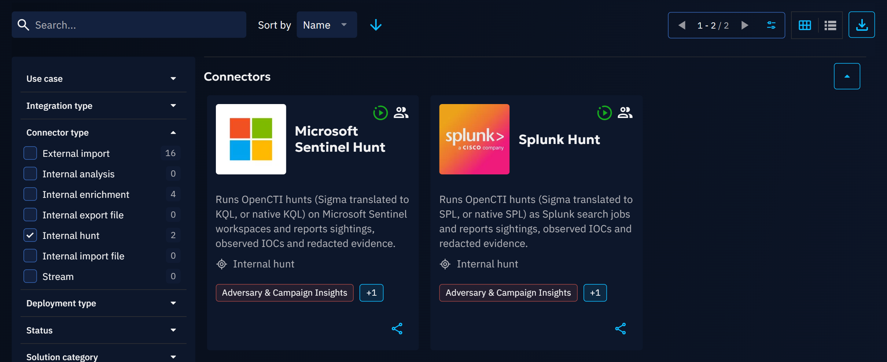
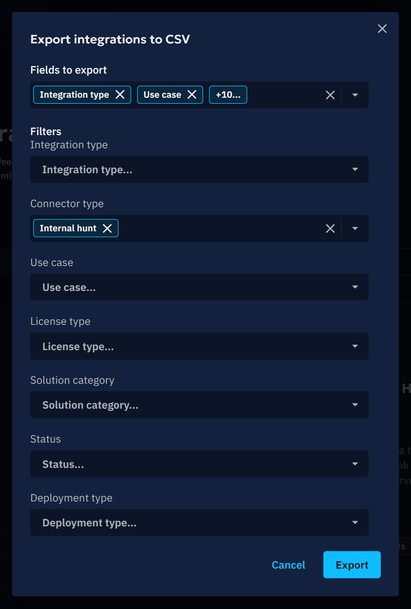
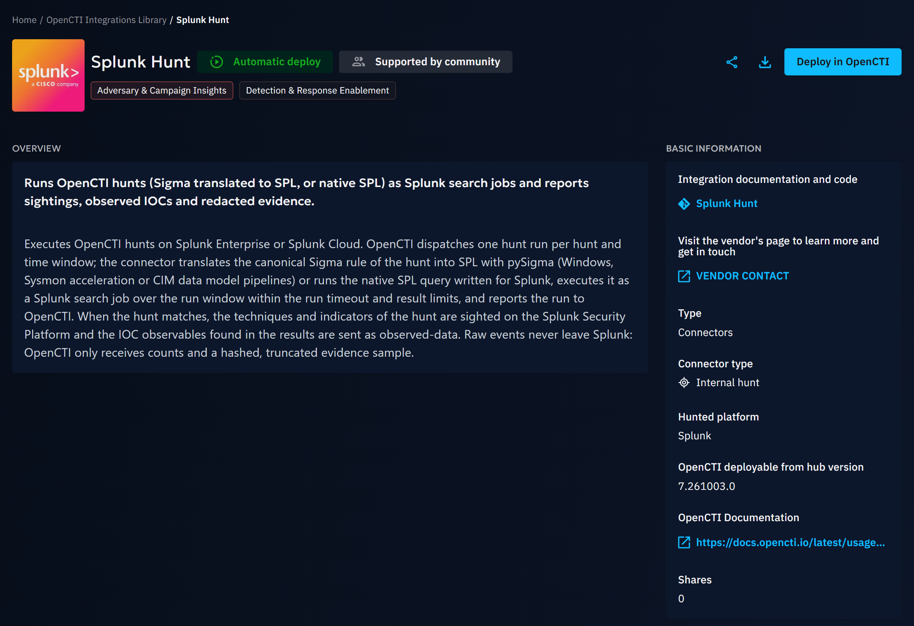
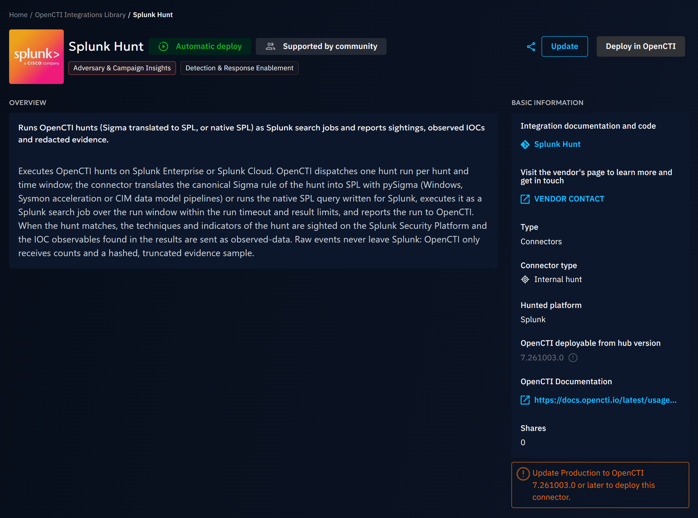

# OpenCTI Integrations Library

A comprehensive library of Integrations is available on XTM Hub, providing seamless access to curated threat intelligence data. 

Currently, the library proposes CSV Feeds, TAXII Feeds, OpenCTI Streams, Third Party Integrations and Connectors.
Depending on the type of Integration, you can either use one click Deploy or download and import it to OpenCTI products.


## Overview

The XTM Hub Integrations library represents a significant advancement in threat intelligence accessibility. 
The library features pre-built Integrations that have been curated by the Filigran team, 
ensuring high-quality, relevant threat intelligence data.

Organizations can benefit from one-click deployment capabilities that integrate directly with connected OpenCTI products, 
while maintaining completely free access without any cost barriers. 

Additionally, the product supports public browsing, allowing users to explore available Integrations without requiring authentication.

## Getting Started

### Accessing the Library

The XTM Hub provides two distinct access methods to accommodate different user needs.

Authenticated access offers the complete feature set, 
including the ability to browse and download Integrations, 
deploy feeds directly to connected OpenCTI products, 
and access detailed feed information and metadata. 

For users who prefer to explore before committing, 
public access provides read-only capabilities through the [Hub public portal](https://hub.filigran.io/), 
where the complete library catalog can be viewed along with feed descriptions and 
details without requiring any connection or subscription.

## Working with Integrations

### Integration Exploration

The XTM Hub provides comprehensive information when you interact with any Integration tile in the library. 
Each Integration includes detailed specifications and content descriptions to help you make informed decisions about any integration.

Download options are readily available for users who prefer manual import processes, 
while sharing capabilities allow you to generate shareable links that facilitate easy 
collaboration with team members and external partners.

The Integrations library offers several filters to help you find the feed that best suits your needs.
You can filter feeds by:

- Use case
- Integration Feed type (CSV Feed, Connector, etc.)
- Connector type (External import, Internal enrichment, Internal hunt, etc., see [Connector types](#connector-types))
- Product compatibility (with connected OpenCTI products)
- Deployment mode (automatic or manual)

### Sharing and Collaborating

The XTM Hub facilitates seamless collaboration through its comprehensive sharing functionality.
Users can generate universal links for any Integration, enabling cross-organization sharing with partners,
clients, or team members without requiring recipients to maintain XTM Hub accounts.

This approach removes barriers to information sharing while maintaining the integrity and
accessibility of threat intelligence data across different organizational boundaries.


### One-Click Deployment

The streamlined deployment process represents the most efficient method for integrating library feeds
into your OpenCTI product (available from OpenCTI 6.7.10).

Before using this functionality, your OpenCTI product must be properly connected in the XTM Hub (see [OpenCTI connection documentation](../user/opencti-connection.md)). 

The deployment process is straightforward: select your desired compatible Integration tile, click on the ```Deploy on OpenCTI``` button, 
choose your target product if multiple products are connected, 
and wait a few seconds until successful integration is confirmed in your OpenCTI product. 
That will open the import drawer, and you must fill in the required information to deploy the Integration.

One click deployment is currently available for

- CSV Feeds
- TAXII Feeds
- Connectors

## Specific feed type considerations

### Manual Import Integrations to OpenCTI

Organizations that prefer traditional import methods can
easily download the desired integration from the library and manually integrate them
into their OpenCTI products. This process involves downloading the Integration file,
navigating to your OpenCTI product, and using the standard Import functionality
to upload and configure the Integration according to your specific requirements.

### Connectors Compatibility

If you don’t know what a connector is you can check this link for further information:
[OpenCTI Connectors Documentation](https://docs.opencti.io/latest/deployment/connectors/)

All CSV feeds are compatible with every OpenCTI version, whereas Connectors require a minimum product version. 
You can verify whether a Connector is compatible with your connected products on both the Connector card:


And the Connector details page:


By hovering over the Connector version, you can see which product needs to be updated to deploy that Connector.

The Connector card and Connector details page also indicate whether the Connector supports automatic deployment.


Some Connectors also display a **Verified** badge. This badge means the Connector is **Verified & SaaS ready**: it has been reviewed and validated by Filigran, ensuring it meets quality and compatibility standards for SaaS environments.

### Connector types

Connector cards and the Connector details page show the type of each Connector, and the **Connector type** filter of
the library lists the Connectors of the selected types, with their count. The CSV export of the library can be
restricted to the same types. The types are those of OpenCTI:

| Connector type | What the Connector does |
|---|---|
| External import | Imports knowledge from an external source on its own schedule. |
| Internal enrichment | Enriches the entities OpenCTI sends to it, manually or automatically. |
| Internal import file | Turns files uploaded to OpenCTI into knowledge. |
| Internal export file | Exports OpenCTI knowledge to a file format. |
| Internal analysis | Analyzes the content of files and entities in OpenCTI. |
| Internal hunt | Executes OpenCTI hunts on one hunted platform and reports sightings, observed indicators and a redacted evidence sample. |
| Stream | Pushes OpenCTI knowledge to another platform in real time. |





**Internal hunt** Connectors run the hunts of OpenCTI (a Sigma rule or a native query over a time window) on a
Security Platform or data lake, such as Splunk, Microsoft Sentinel or Elastic Security. Their details page also shows
the **Hunted platform**. Raw events never leave the hunted platform: OpenCTI only receives hit counts, sightings,
observed indicators and a hashed, truncated evidence sample.



To deploy one:

- your OpenCTI product must provide hunts. Internal hunt Connectors require OpenCTI 7.261003.0 or later; on an older
  product, including a long-term support release based on an older version, the Connector is marked as incompatible
  and is not offered for deployment;
- prepare the URL of the hunted platform and an account or token limited to read-only search: the deployment form of
  OpenCTI asks for them, and XTM Composer receives the credentials encrypted.

When a connected product is too old, the details page names the version to reach and the deploy button stays disabled:



## Technical Requirements and Best Practices

Successful integration with the XTM Hub requires attention to several technical considerations. 
Users deploying feeds must maintain appropriate OpenCTI permissions, 
including UPDATE/CREATE capability for CSV Feeds, TAXII Feeds, OpenCTI Streams, Third Party Integrations or Connectors. 
