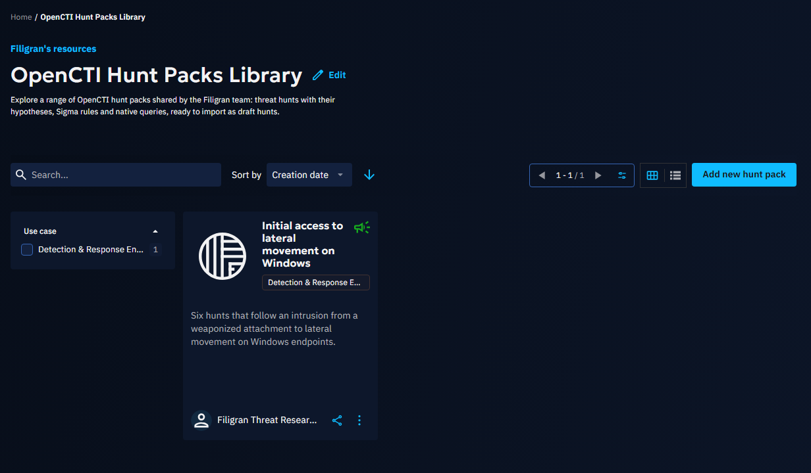
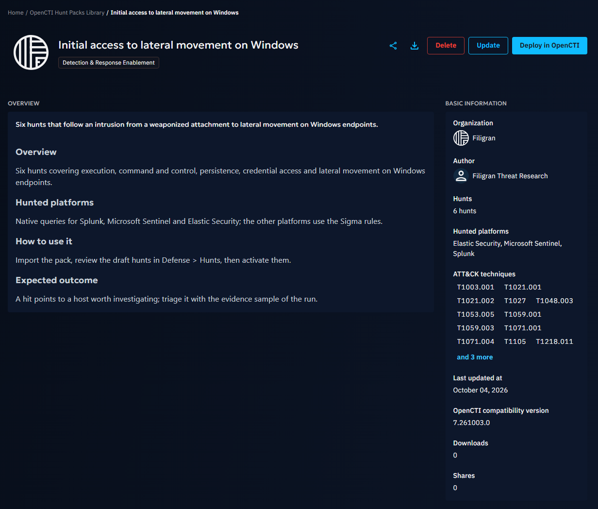

# OpenCTI Hunt Packs Library

The OpenCTI hunt packs library shares ready-to-run threat hunts on the XTM Hub. A hunt pack is a set of OpenCTI
[hunts](https://docs.opencti.io/latest/usage/hunts/): falsifiable hypotheses with a canonical Sigma rule, native
queries for the hunted platforms, and the ATT&CK techniques and threats they target. Hunt packs are executed by the
internal hunt Connectors of the [integrations library](integrations.md#connector-types).

## Overview

All users can browse the library on XTM Hub free of charge, with or without authentication, and read the details
of each hunt pack before deploying it. Manual hunts and hunt pack imports are part of the OpenCTI Community Edition;
scheduled and standing hunts are Enterprise Edition features of OpenCTI.

Every value shown about the content of a pack is read from the pack file when it is uploaded, never typed by hand:

- **Hunts**: the number of hunts in the pack.
- **Hunted platforms**: the platforms the native queries of the pack target, such as Splunk or Microsoft Sentinel.
  A hunt without a native query for your platform is translated from its Sigma rule by the internal hunt Connector.
- **ATT&CK techniques**: the techniques the hunts target. Long lists show the first twelve techniques and fold the
  others into "and N more".

## Working with hunt packs

### Exploring the library

The library lists every published hunt pack. Search by name, filter by use case, and open a pack to read its
description, its hunts, its hunted platforms and its ATT&CK techniques. Download the pack file to import it manually,
or share a link to it with partners who do not have an XTM Hub account.

### Manual import to OpenCTI

Download the pack file, then import it from the hunts list of your OpenCTI product (Defense > Hunts). Importing a
pack creates the missing hunts as drafts and updates the logic of the hunts that already exist, without changing how
and where they run.

### One-click deployment

Before deploying a hunt pack in one click:

- Your OpenCTI product must be connected to the XTM Hub (see [OpenCTI connection documentation](../user/opencti-connection.md)).
- Your OpenCTI product must provide hunts: hunt packs require OpenCTI 7.261003.0 or later. An older product, including
  a long-term support release based on an older version, is marked as incompatible and cannot be selected.
- Your user account must have the Create / Update knowledge capability in OpenCTI.

Select the pack, click `Deploy in OpenCTI`, choose the target product if several are connected, and confirm in
OpenCTI. The hunts of the pack land in Defense > Hunts as drafts, with "XTM Hub" as their source, ready to be
reviewed and activated. Hunts need an internal hunt Connector for each hunted platform to run; deploy them from the
[integrations library](integrations.md#connector-types).

## Publishing a hunt pack

Users allowed to upload to the library publish packs from the library page with `Add new hunt pack`:

1. In OpenCTI, select the hunts to share in Defense > Hunts and export them as a hunt pack.
2. Upload the exported file. The XTM Hub accepts a STIX 2.1 bundle of 1 to 200 hunts, the format OpenCTI exports
   and imports, and rejects any other file with an explanation. It also runs the checks of the OpenCTI import on
   every hunt: a name, a valid Sigma rule when the hunt has one, a schedule that is manual, standing or a cron
   expression firing at most every 15 minutes, and a time window, escalation threshold and result limit within the
   OpenCTI defaults. A pack OpenCTI would refuse is never published.
3. Describe the pack: what it covers, the log sources its hunts need, and how to triage a hit. The hunt count,
   the hunted platforms and the ATT&CK techniques are filled in from the file.
4. Set the OpenCTI version the pack requires. The XTM Hub never accepts a version older than 7.261003.0, the first
   OpenCTI version able to import hunt packs.
