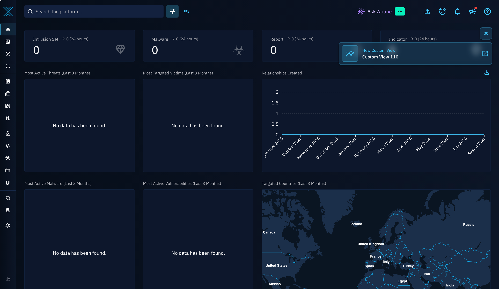

# News Feed

News Feed notifies your connected OpenCTI product whenever new content is published on XTM Hub (for example a new custom dashboard, playbook, or custom view), so you can quickly review it and decide whether to import it, without having to check the Hub manually.

## Requirements

To receive News Feed notifications in OpenCTI, you need:

- An OpenCTI product **connected to XTM Hub** (see [OpenCTI Product Connection](opencti-connection.md)).
- OpenCTI **version 7.260527.0 or later**, which is the first version to support News Feed.
- Content **published and active in one of the Hub libraries** you have access to: [Custom Dashboards](../libraries/custom-dashboards.md), [Playbooks](../libraries/opencti-playbooks.md), or [Custom Views](../libraries/opencti-custom-views.md).

Once connected, OpenCTI checks the Hub for new items **every hour**. News Feed items are only kept for a limited time: they are **automatically deleted after 6 months**, whether or not they were reviewed.

## In OpenCTI

### Toast notification

As soon as OpenCTI retrieves new News Feed item, it shows a toast notification so you immediately know new content is available.

### Notifications page

All received News Feed items are also listed in OpenCTI's notifications:

1. Click the megaphone icon in the top-right corner.
2. Open the notifications page.
3. Review the XTM Hub News Feed items in your notification list.

Opening the notifications page automatically marks these items as read.

### Subscription preferences

Each user can choose which News Feed types (custom dashboards, playbooks, custom views) they want to receive:

1. Open your user menu in the top-right corner.
2. Open your profile.
3. Update your News Feed preferences.

If you disable all feed types, you no longer receive News Feed notifications and the notifications page related to News Feed is hidden.

## Going further

For the complete, up-to-date walkthrough of this feature from the OpenCTI side, see the official [XTM Hub News Feed documentation](https://docs.opencti.io/latest/usage/xtm-hub-news-feed/) on docs.opencti.io.
