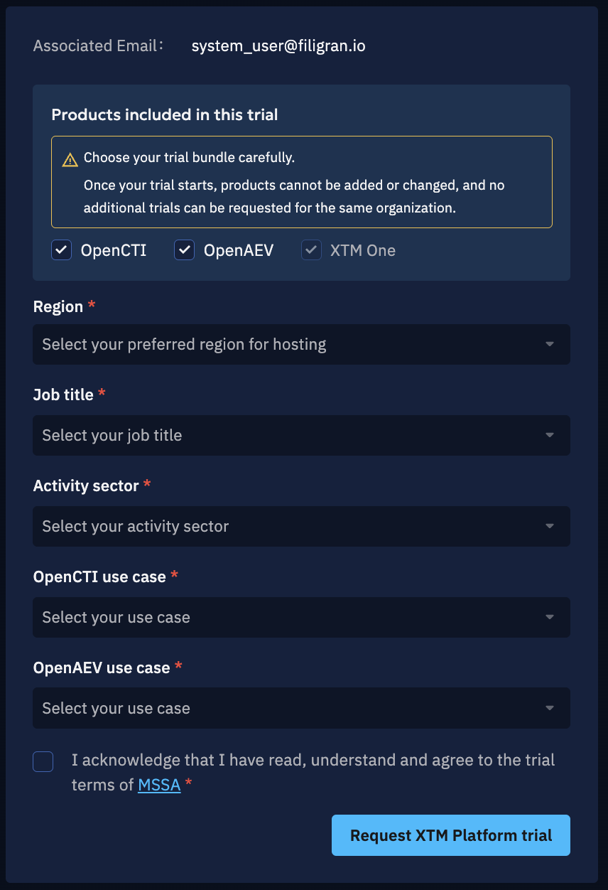
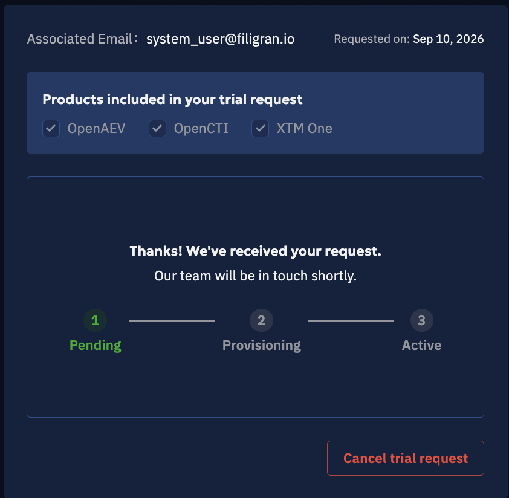
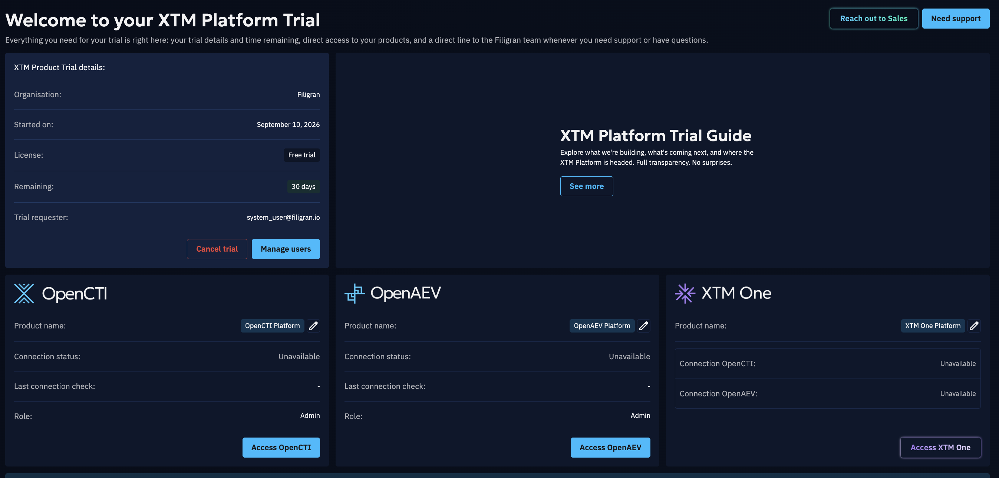
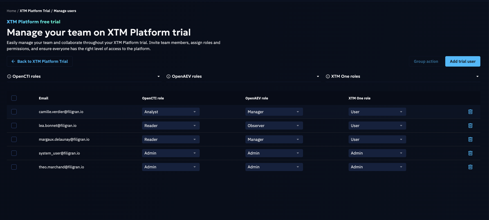

# XTM Platform Trial

The XTM Platform Trial gives your organization a **30-day** access to the Enterprise Edition of several
Filigran products at once. The trial is delivered as a bundle: **XTM One** is always included, together
with **OpenCTI**, **OpenAEV**, or both.

All the products of your bundle are provisioned and managed from a single page in the XTM Hub, and your
team signs in to them with their XTM Hub credentials.

## Request a Trial

To request a trial you must:

- be logged in to the XTM Hub,
- have an organization selected — trials are not available in a
  [personal space](manage-organization.md#personal-space),
- have the **ADMINISTRATE ORGANIZATION** or **MANAGE PLATFORM REGISTRATION**
  [capability](manage-organization.md#available-capabilities) in that organization.

If you do not have the required capability, contact your organization's administrator.

### To Request a Trial

1. Open the main menu.
2. Click **XTM Platform Trial**.
3. Select the products to include in the trial. **XTM One** is always included; select **OpenCTI**,
   **OpenAEV**, or both — at least one of them is required.
4. Select the **Region** in which your products will be hosted: Europe West, United States East,
   Australia or Singapore.
5. Fill in your **Job title** and **Activity sector**, and select a use case for each of OpenCTI and
   OpenAEV you selected. XTM One does not require one.
6. Read and accept the [Master Software Subscription Agreement](https://filigran.io/mssa/).
7. Click **Request XTM Platform trial**.

> ⚠️ Choose your trial bundle carefully. Once your trial starts, products cannot be added or changed,
> and no additional trial can be requested for the same organization.

If your organization already has an ongoing OpenCTI or OpenAEV trial, requesting an XTM Platform Trial
cancels it, and its data is not transferred to the new products.

If Filigran does not have enough capacity to host the trial in the requested region, your request is
placed on a waiting list and starts as soon as a slot becomes available.

## Trial Statuses

The status of your trial is shown on the XTM Platform Trial page. It can be one of the following:

| Status       | Description                                                                                                            |
|--------------|------------------------------------------------------------------------------------------------------------------------|
| Pending      | The trial request has been submitted and is awaiting internal validation to be deployed.  If trial quotas have been reached in the selected region, your request stays pending on a waiting list until a slot becomes available. |
| Provisioning | The products of your trial are being provisioned.                                                                      |
| Active       | The trial is on-going and all its products are accessible.                                                             |
| Cancelled    | The trial has been cancelled.                                                                                          |
| Failed       | The trial provisioning failed due to some technical reasons.                                                           |
| Expired      | The trial period has ended and access is no longer active.                                                             |

While your trial is pending or being provisioned, the page shows the progress of your request and the
date it was requested on.

## Trial Duration and Expiration

All trials last **30 days**. The start date and the number of remaining days are displayed on the
XTM Platform Trial page.

When the trial expires, access to every product of the bundle ends and the platforms are
de-provisioned. To keep using the Enterprise Edition, contact our Sales team.

## Enterprise License

The trial comes with an EE license, with all the Enterprise Edition functionalities of the products
included in your bundle:

- [OpenCTI Enterprise Documentation](https://docs.opencti.io/latest/administration/enterprise/?h=edition)
- [OpenAEV Enterprise Documentation](https://docs.openaev.io/latest/administration/enterprise/?h=enterprise)

## Trial Limitations

Your trial products include all the features of the Enterprise Edition SaaS offering, but run on
limited compute and storage resources:

- **OpenCTI**: up to 40 GB of intelligence data and 3 GB of file storage.
- **OpenAEV**: up to 16 GB.

Large premium feeds can fill this storage quickly. The trial comes with **no SLA**: recovery time is
not guaranteed, so do not store critical data on your trial products.

## Your Trial Page

Once the trial is active, the XTM Platform Trial page gathers everything about it:

- **Trial details**: organisation, start date, license, remaining days and the email of the user who
  requested the trial.
- **One card per product**: its name, its connection status and the date of the last connection check,
  the role you have been granted on it, and an **Access** button to open it. You can rename a product
  from its card. The XTM One card shows its connection to OpenCTI and OpenAEV instead.
- **XTM Platform Trial Guide**: explore what we are building, what is coming next, and where the
  XTM Platform is headed.

If no role has been assigned to you on OpenCTI or OpenAEV, the **Access** button of that product is
disabled — ask the trial requester to grant you one.

## Manage Users on Your Trial

By default, the user who requested the trial is administrator on every product of the bundle.
Administrators can then grant access to other members of the organization.

### To Manage Users

1. Open the XTM Platform Trial page.
2. Click **Manage users**.
3. Click **Add trial user**, select a user from your organization, and assign a role for each product
   of the bundle.

Users can be selected only among the existing users of your organization. Use **Group action** to edit
the roles of several users at once, or to remove users from the trial — removed users lose access to
all the products of the bundle.

Newly added users receive a welcome email and can log in using the same credentials as their XTM Hub
account.

### User Group Mapping (Hub → Products)

To ensure consistent permissions across systems, the role you assign in the XTM Hub maps directly to a
role in each product:

**OpenCTI**

- **Admin**: the administrator role with full access to product settings, configuration and
  management. Admins can manage users, roles and system-wide settings, in addition to having full
  visibility and control over the data.
- **Analyst**: a role with full access to all knowledge within the product. Analysts can create, edit
  and manage entities, relationships and investigations, but do not have access to product settings,
  administration or configuration options.
- **Reader**: a read-only role that allows access to view all data in the product without the ability
  to make any modifications.

**OpenAEV**

- **Admin**: the administrator role with full access to product settings, configuration and
  management. Admins can manage users, roles and system-wide settings, in addition to having full
  visibility and control over the elements.
- **Manager**: a role with full capabilities to manage and run any type of scenario. Managers can
  modify any element in the product but do not have access to product settings, administration or
  configuration options.
- **Observer**: a read-only role that allows access to view all elements in the product without the
  ability to make any modifications.

**XTM One**

- **Admin**: the administrator role with full access to platform settings, configuration and
  management. Admins can manage users, groups, integrations and system-wide settings, in addition to
  having full visibility and control over all elements, including company-managed resources shared
  across the organization. They can impersonate users for troubleshooting.
- **User**: the default role, with full capabilities to create, configure and run their own agents,
  flows and knowledge bases. Users can modify any element they own or that has been shared with them,
  but do not have access to platform settings, administration or configuration options.

Selecting **No access** for OpenCTI or OpenAEV prevents the user from opening that product. Every
trial user must have an XTM One role: **User** is assigned by default.

## Cancellation

You can cancel your trial at any time from the XTM Platform Trial page, with **Cancel trial** once it
is active, or **Cancel trial request** while it is still in progress. A cancellation reason is required.

If your trial has not been provisioned yet, cancelling it does not consume your organization's trial
entitlement and you can request a new one. Once the products have been provisioned, cancelling is
final: your organization will not be able to request another trial.

> ⚠️ A single product of an XTM Platform Trial cannot be cancelled on its own: cancelling the trial
> cancels all its products.

## Contact Us

Selecting **Reach out to Sales**, from the XTM Hub or from the trial page, sends your inquiry directly
to our **Sales team**.

Use this option for questions related to licensing, enterprise packages, pricing, or expansions.

Selecting **Need support**, next to it on the trial page, opens the
[Filigran community on Slack](https://community.filigran.io/) in a new tab.

Use this option for technical questions about the products themselves, to share feedback on your
trial, or to get help from the Filigran team and the community.
